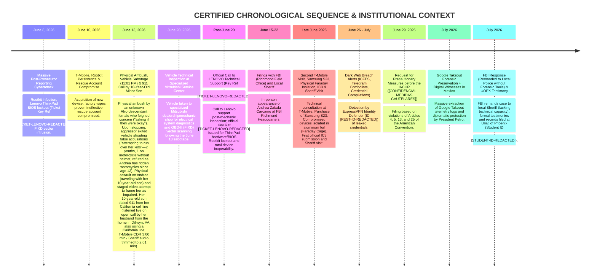

# OFFICIAL TIMELINE OF CYBERATTACKS, LAW ENFORCEMENT REPORTS & HUMAN RIGHTS PETITIONS

**Primary Investigator / Principal Beneficiary:** Andrea Zabala Carcamo (C.C. 43.925.102)  
**Active Secure Contact Channels:** `anzaca0330@gmail.com` | `andrea.zabalacarcamo@email.phoenix.edu` (All other prior accounts unaccessible due to cyberattacks)  
**Origin of Protection:** Digital Witness Solidarity Network & Diplomatic Protection in Mexico.  
**IACHR Status:** Formal Request for Precautionary Measures before the Inter-American Commission on Human Rights **`IACHR - 0000113728`** on behalf of the family unit (Christopher Baez, Arturo Garcia Zabala, and Andrea Zabala Carcamo).  
**Preserved Key Evidence:** Lenovo Technical Support Ticket/Key (**`Key Ref: [TICKET-LENOVO-REDACTED]`** - Rootkit BIOS Lockout) + Complete Google Takeout Backups (~136 GB) + Sheriff Office `.vma` Emergency Audio File.  
**Cybersecurity / Dark Web Monitoring:** ExpressVPN Identity Defender **`Restoration ID: [REST-ID-REDACTED]`** ($3,000,000 USD Restoration Policy).  
**U.S. Police Case / Incident Number:** Buckingham County Sheriff's Office **`Incident C20260617-0024-01`**.  

---

## 🧭 1. GENERAL CHRONOLOGY OF CYBERATTACKS & SYSTEMIC PERSECUTION PATTERN

---

## 🛡️ 2. INSTITUTIONAL CONTEXT & PROBATORY ACCUMULATION

### 2.1. Support from "Digital Witnesses", Research Network & Protection in Mexico
- **Independent Verification & Colleague Network:** The current protection and shelter of the investigator did not happen by chance, but as a direct response from an **international network of observers and "digital witnesses"** (over 70,000 citizens and observers) who evaluated the technical rigor of her E-14 audit reports. Andrea Zabala does not work in isolation: she is part of a collaborative team of **independent colleague auditors and researchers** working across distinct investigation fronts regarding electoral and administrative irregularities.
- **Volumetric Scale of Preserved Forensic Evidence (~136 GB):** The complete forensic case file is backed by an **immutable ~136 GB evidence repository**, comprising high-resolution E-14 tally sheet scans, OCR dataset extractions, massive Google Takeout telemetry logs, ISP connection logs, certified emergency audio files, and forensic analysis scripts.
- **Systemic Pattern of Harassment:** Cyberattacks and physical sabotage **were not isolated incidents against Andrea Zabala**, but part of a **systemic pattern of persecution against independent auditors and researchers** exposing alterations in E-14 election tally sheets.
- **Certified Academic Standing, Verified Skills Profile & Community Leadership (University of Phoenix & Scouting America):** The investigator formalised the chronological sequence of events and academic documentation with the **University of Phoenix (`login.phoenix.edu`)**, where she is enrolled as an active full-time student under **`Student Number: [STUDENT-ID-REDACTED]`** in the **BSIOP (Bachelor of Science in Industrial-Organizational Psychology)** program maintaining a **strong 3.61 GPA** (with **120.87 prior credits transferred from Universidad de Antioquia**).
  - **U.S. Educational Work Experience (California & Virginia):** Andrea Zabala has professional work experience in the U.S. educational sector as an **Afterschool Teacher** in **California** and as a **Preschool Aide** in **Virginia**, directly backed by certified academic skills in **`Classroom Management`**, **`Child Development`**, **`Behavior Management`**, and **`Individualized Education Programs (IEP)`**.
  - **Verified Platform Skills (`careers.phoenix.edu`):** Her official university profile certifies 73 core competencies, including **`Chi-Squared Tests`** and **`Analysis Of Variance (ANOVA)`** (validating her expert capability in hypothesis testing and statistical inference for E-14 forensic audits), **`Good Driving Record`** (certified flawless driving history badge dismantling and refuting the aggressor's false "attempted hit-and-run" allegations), **`Bilingual (Spanish/English)`**, **`CPR Certification`**, **`First Aid Certification`**, and **`Ethical Standards And Conduct`**.
  - **Community Leadership in the U.S. (Scouting America / Wood Badge):** Although her formal membership in **Scouting America (Scouts of America)** is relatively recent in the U.S., the Scout Law and the Scouting way of life have been her personal compass and lifestyle for years. Andrea Zabala serves as an active adult volunteer and leader alongside her 10-year-old son, currently completing her **Wood Badge** qualification (the highest level of advanced adult leadership, conflict resolution, and youth protection training in Scouting).
  - **Grade Clarification & Direct Academic Damage:** In course **`PSY/335 Research Methods`**, her actual earned grade is **`A-`** (backed by gradebook portal screenshots, pending administrative transcript update from a temporary C). As documentary proof of **direct academic damages caused by the June 2026 attack** (ThinkPad BIOS lockout, vehicle sabotage, and emergency relocation), her official transcript records an involuntary emergency withdrawal (**`Grade: W` - Withdrawn**) in **`PSY/315 Statistical Reasoning in Psychology`**, a course she was prevented from completing due to device destruction and acute threat.

---

### 2.2. Key Technical Evidence Preserved in Chain of Custody (136 GB Forensic Repository)

1. **LENOVO Customer Service Ticket / Key (`Key Ref: [TICKET-LENOVO-REDACTED]`):**  
   *Official technical support record issued by Lenovo post-June 20 under reference **[TICKET-LENOVO-REDACTED]** reporting the total hardware/BIOS lockout and inoperability of her ThinkPad laptop caused by a persistent Rootkit/Bootkit attack.*
2. **GOOGLE TAKEOUT Backups & Compromised Rescue Account:**  
   *Complete, immutable compressed Google Takeout backup archives containing login IP histories, intercepted sessions, device telemetry, and location logs.* Additionally, access to the compromised drive account (`https://drive.google.com/drive/folders/1KSE__jPvCS7gkPAuB3ic64vAFDqqonLx`) is preserved in "View Only" status as live forensic proof of rescue account hijacking.
3. **Sheriff Department .VMA Audio Recording (Initial Denial, Minor Son's Call & Duration Discrepancy):**  
   *While certified T-Mobile billing records (`Check Your Device Usage Details _ T-Mobile1.pdf`) confirm that the 911 emergency call placed on June 13, 2026 at 11:01 PM —**placed directly by Andrea Zabala's 10-year-old minor son from her California cell line** immediately after the physical assault and staged false-accusation attempt, listened to live on an open line by her husband from **the house in Dillwyn, VA** (also using a California line)— had a network duration of **3:00 minutes**, the Buckingham County Sheriff's Office **initially denied the existence of the call claiming it could not be found**. Only after being confronted with certified T-Mobile CDR proof did local police release an audio file, but provided a trimmed **2.01-minute file** (`.vma`).* This **initial concealment followed by a ~59-second discrepancy** (1 minute and 59 seconds trimmed from the delivered audio) constitutes forensic proof of bad faith, evidence tampering, and deliberate suppression of emergency recordings to hide the child's plea for help, ambient assault audio, or police dispatch anomalies.
4. **Specialized Mitsubishi Vehicle Inspection & OBD-II (FIXD) Device:**  
   *Vehicle brought on June 20, 2026 to a specialized Mitsubishi dealership/mechanic shop for electrical system diagnostics and sealing of the physical OBD-II (FIXD) dongle preserved as a physical/wireless attack vector.*
5. **Physical Device Faraday Isolation:**  
   *Preserved physical evidence of heavy aluminum foil wrapping used to isolate and block external wireless signals (Wi-Fi, Bluetooth, Cellular) on compromised devices during the late June crisis.*

---

6. **Phantom Wi-Fi Network & Electrical Disconnection Inefficacy:**
   - During the residential inspection, the cable company technician verified the presence of a constant, abnormal wireless signal coming from the Aircove router.
   - Additionally, a Wi-Fi network with a fictitious name previously created by me for testing purposes persists and continues to transmit a constant signal, though its physical source is unlocatable.
   - The cable technician and my husband attempted to resolve the issue by completely replacing both the modem and the router, but the phantom network remained active and visible on the spectrum.
   - In an extreme test, **we shut off the main electrical power breaker for the entire house**, leaving the residence completely without electricity and in total darkness. Incredibly, the fictitious Wi-Fi network remained active, transmitting a signal and visible on network scanners. Neither the technician nor my husband could locate the physical transmitter source, conclusively proving the physical implant of a hidden, autonomous spying device inside the property or its immediate vicinity.

### 2.3. Status of FBI Complaint & Institutional Lack of Protection in the U.S.
- **Submissions to FBI & IC3:** In late June, after exhausting technical options at T-Mobile, purchasing a secure device (Samsung S23) in a controlled environment, and wrapping compromised devices in aluminum foil, the **first IC3 report** was submitted and the Sheriff was visited. Andrea Zabala Carcamo appeared in person at the **FBI Richmond Field Office (Virginia)** submitting all findings, scripts, Google Takeout backups, and E-14 audit reports.
- **Lack of Response & Remand to Local Police:** In late July 2026, upon checking case status, **the FBI stated that the investigation was remanded back to local law enforcement (Buckingham County Sheriff's Office)**, despite the Sheriff's Office having previously admitted to lacking the technological tools and advanced cybersecurity training required to investigate firmware/rootkit intrusions.

---

### 2.4. Active Dark Web Monitoring & Identity Protection (ExpressVPN Identity Defender)
- **Restoration ID:** `[REST-ID-REDACTED]` ($3,000,000 USD Identity Theft Insurance Policy with Assurant).
- **Recorded Data Leak Alerts:** `icfes.gov.co` (July 2026), `Credential Compilations 785M / 239M / 47M / 12M`, `Combolists Posted to Telegram`.
- **Active Data Removal Requests:** Ongoing removal requests across 16 data broker sites (`BackgroundCheckGateway`, `USSearch`, `PublicRecords`, `Intelius`, `EasyBackgroundChecks`, `OnlineSearches`).

---

## 📊 3. OFFICIAL CASE MATRIX AND CERTIFICATES

| Entity / Organization | Reference / Case Number | Date | Status / Details |
|---|---|---|---|
| **IACHR (OAS)** | **`PRECAUTIONARY MEASURE - IACHR - 0000113728`** | **06/29/2026** | Application filed for Christopher Baez, Arturo Garcia Zabala, and Andrea Zabala |
| **University of Phoenix** | **`Student ID: [STUDENT-ID-REDACTED]`** | **03/2025 - Present** | **BSIOP Program (GPA 3.61) / June Forced Withdrawal (`Grade: W` PSY/315)** |
| **Mitsubishi Vehicle Service** | **Specialized Dealer Diagnostics** | **06/20/2026** | **Electrical diagnostics & OBD-II (FIXD) vector inspection** |
| **Lenovo Support** | **`Key Ref: [TICKET-LENOVO-REDACTED]`** | **Post-06/20/2026** | **Official BIOS Rootkit Lockout Certificate ( ThinkPad )** |
| **Google Telemetry** | **Google Takeout Archives** | **July 2026** | **Full forensic archives of login logs and IP addresses** |
| **FBI (Richmond / IC3)** | **In-Person Tip / IC3 Online** | **June 2026** | **Initial IC3 report; Remanded back by FBI to Local Police** |
| **Sheriff (Buckingham, VA)** | **`Incident C20260617-0024-01`** | **06/17-18 & Late June** | Cyberattack report, Faraday isolation (2.01 min `.vma` audio trimmed) |
| **ExpressVPN Defender** | **`Restoration ID: [REST-ID-REDACTED]`** | **July 2026** | Dark Web Breach Monitoring (`icfes.gov.co`, Telegram) & $3M USD Policy |
| **Presidency of Colombia** | **Diplomatic Protection** | **July 2026** | Diplomatic Protection in Mexico supported by Digital Witnesses Network |
