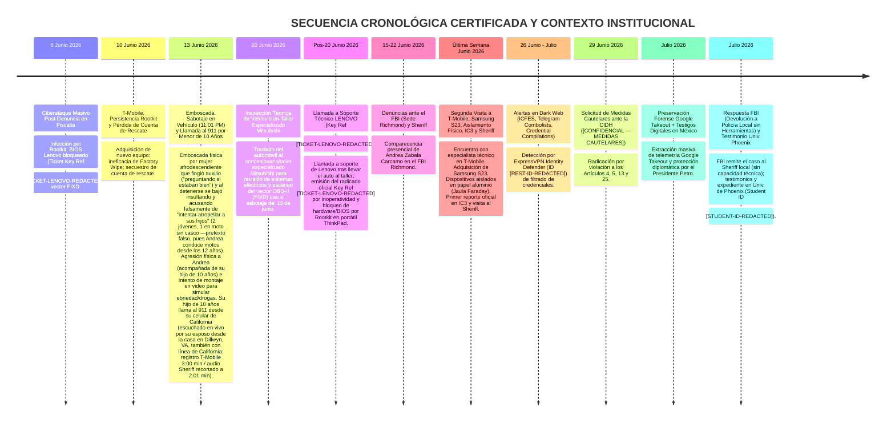

# LÍNEA DE TIEMPO OFICIAL DE CIBERATAQUES, DENUNCIAS POLICIALES Y DERECHOS HUMANOS

**Especialista / Beneficiaria Principal:** Andrea Zabala Carcamo (C.C. 43.925.102)  
**Canales Activos de Contacto Seguro:** `anzaca0330@gmail.com` | `andrea.zabalacarcamo@email.phoenix.edu` (Demás cuentas inaccesibles por ciberataques)  
**Origen del Resguardo:** Red de Solidaridad de Testigos Digitales y Protección Diplomática en México.  
**Estatus CIDH:** Solicitud Formal de Medidas Cautelares ante la CIDH **`IACHR - 0000113728`** a nombre del núcleo familiar (Christopher Baez, Arturo Garcia Zabala y Andrea Zabala Carcamo).  
**Evidencia Clave Preservada:** Ticket/Key de Soporte Técnico Lenovo (**`Key Ref: [TICKET-LENOVO-REDACTED]`** - Bloqueo BIOS por Rootkit) + Respaldos Completos Google Takeout (~136 GB) + Archivo .vma del Sheriff.  
**Monitoreo Ciberseguridad / Dark Web:** ExpressVPN Identity Defender **`Restoration ID: [REST-ID-REDACTED]`** (Póliza $3.000.000 USD).  
**Radicado Policial EE.UU.:** Buckingham County Sheriff's Office **`Incident C20260617-0024-01`**.  

---

## 🧭 1. CRONOGRAMA GENERAL DE CIBERATAQUES Y PATRÓN SISTÉMICO DE PERSECUCIÓN

---

## 🛡️ 2. CONTEXTO INSTITUCIONAL Y ACUMULADO PROBATORIO

### 2.1. El Apoyo de los "Testigos Digitales", Red de Investigadores y Protección en México
- **Verificación Independiente y Red de Colegas:** La protección y resguardo actual de la especialista no surgió al azar, sino como respuesta directa de una **red internacional de veedores y "testigos digitales"** (más de 70,000 ciudadanos y observadores) que evaluaron la solidez técnica de sus dictámenes E-14. Andrea Zabala no trabaja sola: forma parte de un equipo articulado de **investigadores y auditores independientes** que avanzan paralelamente en distintas áreas de investigación sobre corrupción e irregularidades electorales.
- **Volumen del Acervo Probatorio Preservado (~136 GB):** La totalidad del expediente pericial de la investigación se encuentra respaldada en un **acervo forense inmutable de aproximadamente 136 GB**, que incluye imágenes de actas E-14 en alta resolución, extracciones OCR, respaldos masivos de telemetría Google Takeout, logs de ISP, audios de emergencia certificados y scripts de análisis estadístico.
- **Patrón Sistémico de Hostigamiento:** Se ha confirmado que las agresiones telemáticas y sabotajes **no han sido hechos aislados contra Andrea Zabala**, sino que forman parte de un **patrón sistemático de persecución contra múltiples auditores e investigadores independientes** que han evidenciado alteraciones en las actas E-14.
- **Seguimiento Académico Certificado, Perfil de Competencias y Liderazgo Comunitario (Universidad de Phoenix y Scouting America):** La especialista ha formalizado la secuencia cronológica de los hechos y sus respaldos académicos ante la **Universidad de Phoenix (`login.phoenix.edu`)**, donde figura inscrita como estudiante activa a tiempo completo bajo el número de estudiante **`Student Number: [STUDENT-ID-REDACTED]`** en el programa **BSIOP (Bachelor of Science in Industrial-Organizational Psychology)** con un **GPA destacado de 3.61** (con homologación previa de **120.87 créditos en la Universidad de Antioquia**).
  - **Experiencia Laboral en Educación (California y Virginia):** Andrea Zabala cuenta con trayectoria profesional en el sector educativo estadounidense como **Profesora de Programa Extracurricular (*Afterschool Teacher*)** en **California** y como **Asistente Preescolar (*Preschool Aide*)** en **Virginia**, respaldada por sus competencias certificadas en **`Classroom Management`**, **`Child Development`**, **`Behavior Management`** e **`Individualized Education Programs (IEP)`**.
  - **Competencias Oficiales Verificadas en Plataforma (`careers.phoenix.edu`):** En su perfil académico y profesional oficial consta la certificación en 73 competencias clave, incluyendo **`Chi-Squared Tests`** y **`Analysis Of Variance (ANOVA)`** (que respaldan su solvencia en pruebas de hipótesis e inferencia estadística aplicadas al peritaje E-14), **`Good Driving Record`** (distintivo de registro de conducción impecable que desmonta y refuta documentalmente las falsas acusaciones de montaje sobre presunto intento de atropello), **`Bilingual (Spanish/English)`**, **`CPR Certification`**, **`First Aid Certification`** y **`Ethical Standards And Conduct`**.
  - **Liderazgo Comunitario en EE.UU. (Scouting America / Wood Badge):** Aunque su vinculación formal a la organización **Scouting America (Scouts of America)** es relativamente reciente en EE.UU., los valores y el modo de vida Scout han sido su filosofía personal desde hace años. Andrea Zabala participa como voluntaria y líder activa junto a su hijo menor de 10 años, encontrándose actualmente culminando la certificación **Wood Badge** (el más alto nivel de capacitación avanzada en liderazgo para adultos, resolución de conflictos y conducta ética en el movimiento Scout).
  - **Aclaración de Notas y Perjuicios Directos:** En la materia **`PSY/335 Research Methods`**, la nota real obtenida es **`A-`** (respaldada por capturas de pantalla de la plataforma de calificaciones, pendiente de actualización administrativa en la transcripción oficial que figura temporalmente como C). Como prueba documental de los **perjuicios académicos directos causados por el ataque de junio de 2026** (inoperatividad del portátil ThinkPad por Rootkit, sabotaje vehicular y desplazamiento forzado), consta el retiro obligado (**`Grade: W` - Retiro/Cancelación**) en la materia **`PSY/315 Statistical Reasoning in Psychology`**, curso que no pudo culminar debido a la crisis y destrucción de equipos.

---

### 2.2. Evidencias Técnicas Clave Preservadas en la Cadena de Custodia (Acervo Forense de 136 GB)

1. **Ticket / Key de Servicio al Cliente LENOVO (`Key Ref: [TICKET-LENOVO-REDACTED]`):**  
   *Registro oficial de soporte técnico emitido por Lenovo posterior al 20 de junio bajo el código **[TICKET-LENOVO-REDACTED]** al reportar la inoperatividad y el bloqueo a nivel de hardware/BIOS del portátil ThinkPad derivado del ataque de Rootkit/Bootkit persistente.*
2. **Descargas de Respaldo GOOGLE TAKEOUT y Cuenta Interceptada:**  
   *Descarga completa e inmutable de los archivos comprimidos de Google Takeout, que contienen el historial de IPs de inicio de sesión, sesiones interceptadas, telemetría de dispositivos y registros de ubicación.* Además, se preserva el enlace al Drive de la cuenta secuestrada (`https://drive.google.com/drive/folders/1KSE__jPvCS7gkPAuB3ic64vAFDqqonLx`), la cual actualmente cuenta únicamente con permisos de "solo lectura" (View Only), constituyendo una prueba técnica viva del secuestro de la cuenta de rescate.
3. **Grabación de Audio .VMA del Departamento del Sheriff (Negación Inicial, Llamada del Hijo Menor y Discrepancia de Duración):**  
   *Mientras que el registro oficial certificado de facturación de T-Mobile (`Check Your Device Usage Details _ T-Mobile1.pdf`) establece que la llamada de emergencia al 911 realizada el 13 de junio de 2026 a las 11:01 PM —**efectuada directamente por el hijo menor de 10 años de Andrea Zabala desde su celular de California** inmediatamente después de la agresión física de la mujer afrodescendiente que intentó realizar un montaje simulando atropello y estado de ebriedad/drogas, escuchada en vivo en línea abierta por su esposo desde **la casa en Dillwyn, VA** (quien también posee una línea con código de California)— tuvo una duración de red de **3:00 minutos**, la Buckingham County Sheriff's Office **negó inicialmente la existencia de la llamada afirmando no haberla encontrado**. Únicamente tras ser confrontados con la prueba irrefutable del registro de facturación telefónica de T-Mobile, la policía local procedió a entregar un archivo de audio, pero remitió una versión recortada `.vma` de únicamente **2.01 minutos**.* Esta **ocultación inicial seguida de una discrepancia de ~59 segundos** (1 minuto y 59 segundos recortados del audio entregado) constituye una prueba pericial de mala fe, alteración de evidencia y supresión deliberada del registro oficial de emergencia para ocultar la voz de auxilio del menor, audios de ambiente del ataque o inconsistencias policiales.
4. **Inspección Técnica de Vehículo en Taller Mitsubishi y Dispositivo OBD-II (FIXD):**  
   *Ingreso del vehículo el 20 de junio de 2026 a taller especializado Mitsubishi para diagnóstico de sistemas eléctricos y sellado del dispositivo físico OBD-II (FIXD) preservado como vector de ataque físico/inalámbrico.*
5. **Aislamiento Físico (Faraday) de Dispositivos:**  
   *Evidencia del uso de papel aluminio para contener y neutralizar conexiones externas (Wi-Fi, Bluetooth, Celular) de los equipos comprometidos durante la crisis en la última semana de junio.*

---

### 2.3. Estado de la Denuncia ante el FBI y Desprotección Institucional en EE.UU.
- **Entregas al FBI e IC3:** En la última semana de junio, tras agotar instancias técnicas en T-Mobile y adquirir un dispositivo seguro (Samsung S23) en un ambiente controlado y asilar equipos comprometidos en papel aluminio, se generó el **primer reporte en el IC3** y se visitó al Sheriff. Andrea Zabala Carcamo compareció en persona ante la sede del **FBI en Richmond (Virginia)** y radicó la totalidad de sus hallazgos, scripts, respaldos de Google Takeout y dictámenes E-14.
- **Falta de Respuesta y Remisión a la Policía Local:** En la última semana de julio de 2026, al consultar el estado del expediente, **el FBI informó que devolvió la investigación a la policía local (Buckingham County Sheriff's Office)**, a pesar de que esta entidad había declarado previamente carecer de las herramientas tecnológicas y capacitación en ciberseguridad avanzada para investigar intrusiones de firmware/rootkit.

---

### 2.4. Monitoreo Activo de Dark Web y Protección de Identidad (ExpressVPN Identity Defender)
- **Restoration ID:** `[REST-ID-REDACTED]` (Póliza de Restauración por $3,000,000 USD suscrita con Assurant).
- **Alertas Registradas de Filtración:** `icfes.gov.co` (Julio 2026), `Credential Compilations 785M / 239M / 47M / 12M`, `Combolists Posted to Telegram`.
- **Acciones de Remoción Solicitadas:** Procesos en curso para la eliminación de información personal en 16 portales de rastreo (`BackgroundCheckGateway`, `USSearch`, `PublicRecords`, `Intelius`, `EasyBackgroundChecks`, `OnlineSearches`).

---

## 📊 3. MATRIZ OFICIAL DE EXPEDIENTES Y CERTIFICADOS

| Entidad / Organismo | Radicado / N° de Caso | Fecha | Estado / Detalle |
|---|---|---|---|
| **CIDH (OEA)** | **`PRECAUTIONARY MEASURE - IACHR - 0000113728`** | **29/06/2026** | Solicitud a nombre de Christopher Baez, Arturo Garcia Zabala y Andrea Zabala |
| **Universidad de Phoenix** | **`Student ID: [STUDENT-ID-REDACTED]`** | **03/2025 - Presente** | **BSIOP Program (GPA 3.61) / Retiro Forzado en Junio (`Grade: W` PSY/315)** |
| **Servicio Vehicular Mitsubishi** | **Ingreso Taller Especializado** | **20/06/2026** | **Revisión eléctrica e inspección de vector OBD-II (FIXD)** |
| **Soporte Lenovo** | **`Key Ref: [TICKET-LENOVO-REDACTED]`** | **Pos-20/06/2026** | **Certificado oficial de bloqueo BIOS por Rootkit ( ThinkPad )** |
| **Google Telemetry** | **Descargas Google Takeout** | **Julio 2026** | **Respaldos completos de logs de inicio de sesión e IPs** |
| **FBI (Richmond / IC3)** | **Tip Presencial / IC3 Online** | **Junio 2026** | **Primer reporte IC3; Enviado de vuelta por FBI a Policía Local** |
| **Sheriff (Buckingham, VA)** | **`Incident C20260617-0024-01`** | **17-18 y fines de Junio** | Reporte por piratería, Jaula Faraday y dispositivos en papel aluminio (Audio .vma 2.01 min) |
| **ExpressVPN Defender** | **`Restoration ID: [REST-ID-REDACTED]`** | **Julio 2026** | Monitoreo Dark Web (`icfes.gov.co`, Telegram) y Póliza $3M USD |
| **Presidencia de Colombia** | **Protección Diplomática** | **Julio 2026** | Protección Diplomática en México por Veintena de Testigos Digitales |
