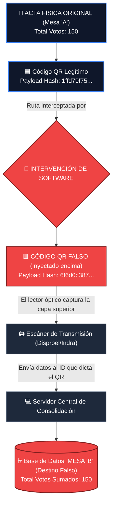

# Diagrama Forense: Redirección de Transmisión (Spoofing de Códigos QR)

El siguiente diagrama esquematiza cómo el acta original de una mesa fue desviada informáticamente hacia el ID de otra mesa en el sistema central de consolidación, explotando la arquitectura de escaneo automático de la empresa contratista de transmisión.

> [!CAUTION]
> **🔴 PRUEBA DE REDIRECCIÓN MASIVA**
> Este diagrama ilustra el hallazgo documentado en la investigación (Pilar #3), donde la superposición de una capa con un Código QR falso logró secuestrar el flujo de datos del escáner en tiempo real, engañando a la base de datos nacional.

## Interpretación Pericial del Flujo:
1. **Entró por aquí (Mesa A):** El jurado diligenció el documento oficial físico asignado a su mesa.
2. **Intervención:** El *software* malicioso superpuso una capa transparente con un QR falso (y su respectivo hash/payload alterado) antes o durante la fase de digitalización.
3. **Salió por aquí (Mesa B):** Al pasar por las máquinas automatizadas de transmisión, el escáner leyó ciegamente el QR superior y envió los resultados a la base de datos, adjudicándolos al ID de la Mesa B.
