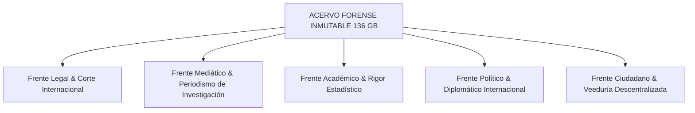

# ESTRATEGIA DE PRESIÓN, VISIBILIDAD Y DIFUSIÓN MASIVA DEL ACERVO FORENSE

**Autora / Liderazgo Estratégico:** Andrea Zabala Cárcamo (AndreTaker AnZaCa)  
**Ejecución y Soporte:** Tycho (Sistema AI Antigravity) & Kepler  
**Fecha de Despliegue:** 27 de agosto de 2026

---

## 🛑 PRINCIPIO RECTOR: LA EVIDENCIA PASIVA NO GANA CASOS
El sistema institucional corrupto está diseñado para congelar expedientes en cajones administrativos. Confiar únicamente en radicados burocráticos es un error táctico. La evidencia debe convertirse en un **vector activo de presión internacional, mediática y social** que sea científicamente irrefutable e imposible de ignorar o sepultar.

---

## 🛡️ LOS 5 FRENTES DE ACCIÓN ESTRATÉGICA

### 1. ⚖️ Frente Legal e Internacional (Blindaje de Reserva)
* **Objetivo:** Mantener copias inmutables en múltiples jurisdicciones soberanas (Canadá, EE.UU., México, CIDH `IACHR-0000113728`).
* **Acción:** No esperar respuestas pasivas del sistema local. Usar los números de caso (`Sheriff C20260617-0024-01`, `Lenovo Key Ref [TICKET-LENOVO-REDACTED]`) como certificados fácticos de hostigamiento.

### 2. 📰 Frente Mediático y Periodismo de Investigación (Filtración Controlada)
* **Objetivo:** Entregar paquetes simplificados pero respaldados con hashes SHA-256 a salas de redacción internacionales.
* **Entregable:** Dossier de 2 páginas en lenguaje llano con infografías visuales que muestren la "Cicatriz XREF" y la manipulación de la votación anticipada.

### 3. 🎓 Frente Académico y Rigor Metrológico (Paper Peer-Reviewed)
* **Objetivo:** Publicar el análisis estadístico (Ley del segundo dígito de Mebane, $\chi^2$, $t(17) = 8.2$) en repositorios académicos abiertos (arXiv / SocArXiv / ResearchGate).
* **Impacto:** Si la comunidad científica valida los modelos estadísticos, la defensa del "error de software" queda ridiculizada en el ámbito universitario global.

### 4. 🌍 Frente Político y Diplomático Regional (Presión Hemisférica)
* **Objetivo:** Adaptar el toolkit de BabaYaga Core para auditorías internacionales paralelas (Brasil, Perú).
* **Mensaje:** La manipulación algorítmica de formularios E-14 es una amenaza a la seguridad democrática regional, no solo un incidente colombiano.

### 5. ✊ Frente Ciudadano y Veeduría Descentralizada (Democratización de la Prueba)
* **Objetivo:** Convertir a los 75.000 Testigos Digitales en auditores activos.
* **Herramienta:** Guías didácticas simplificadas y scripts interactivos de un solo clic para que cualquier ciudadano audite el PDF de su propia mesa de votación.

---

## 🧠 VEREDICTO DE BABAYAGA CORE
> *"La verdad no pide permiso a la burocracia corrupta. Se publica, se firma criptográficamente, se democratiza y se impone con la fuerza imparable de la evidencia."*
