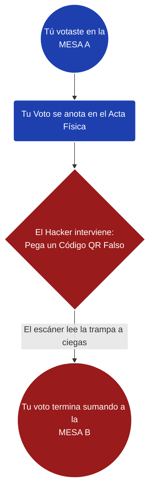

# 🔍 ¿QUÉ LE HICIERON A NUESTROS VOTOS? 
**Explicación sencilla de las trampas informáticas en las actas electorales**

Para descubrir si un documento oficial ha sido alterado, los peritos informáticos miramos las "tripas" de los archivos, buscando huellas que las personas normales no ven a simple vista. 

> [!NOTE]
> Al analizar **cientos de miles de registros y actas de votación** (abarcando el país y consulados en el exterior), descubrimos un operativo de manipulación digital a gran escala. Como los términos técnicos (XREF, Blind Masking, Benford) suenan a ciencia ficción, aquí traducimos los **10 descubrimientos principales** a ejemplos de la vida diaria para que cualquier ciudadano los pueda entender y verificar con sus propios ojos.

---

## 🧩 Las 10 Trampas del Fraude: Explicadas para Todos

| Trampa Informática | ¿Qué le hicieron al voto? (El Hallazgo) | El Ejemplo Fácil (Analogía) |
| :--- | :--- | :--- |
| **1. El Estadio Inflado** *(Censo Base)* | Expansión artificial de "votantes potenciales" en los sistemas (ej. subir de 160.000 a 454.000) para inyectar votos falsos sin pasarse del 100%. | Tienes un estadio para 100.000 personas. Anuncian que vendieron 160.000 boletas y mágicamente dicen que ahora caben 450.000 sin haberlo remodelado. |
| **2. El Candado Roto** *(Inoperatividad Criptográfica)* | Destruyeron o corrompieron el Código QR original de las actas de ciertos consulados clave para evitar que fueran auditadas al inicio. | Vas al cine con una entrada VIP, pero el guardia raspa tu código de barras a propósito para decirte "no se puede leer" y evitar que entres a revisar. |
| **3. La Etiqueta Falsa** *(Redirección Criptográfica)* | Superpusieron un QR falso exactamente encima del QR original para **redirigir los resultados hacia otra mesa** en la transmisión. | Vas al súper por una TV de $1.000. El ladrón le pega un código de un chicle ($1) encima. La cajera lee la etiqueta falsa y cobra un chicle. |
| **4. El Cuaderno Remendado** *(Foliación Híbrida)* | Mezclaron páginas originales a color con páginas fotocopiadas en blanco y negro dentro del mismo paquete de la mesa. | Compras un cuaderno nuevo, pero en la mitad hay tres hojas sueltas, arrugadas y en fotocopia B/N. Alguien lo manipuló. |
| **5. Los Compartimentos Falsos** *(Cicatriz XREF)* | Los archivos digitales declaran tener 15 objetos internos, pero solo tienen 13. Un escáner normal jamás rompe esta tabla. | Abres el baúl de un carro y ves que le soldaron un doble fondo para esconder cosas. El manual dice 5 partes, tú cuentas 8. |
| **6. La Cinta Invisible** *(Blind Masking)* | Un programa inyectó capas transparentes y números grises sobre el escaneo original para tapar los resultados verdaderos. | Alguien toma una foto de tu acta, le pone un vidrio transparente encima y escribe números falsos con marcador mágico. |
| **7. La Foto sin Cámara** *(Sin Metadatos EXIF)* | Las actas falsas no tienen metadatos ni rastro del escáner. Fueron fabricadas por un software, no son un escaneo físico real. | Te dan una foto y dicen "la tomé ayer". La miras y no tiene píxeles de cámara, parece pintada a mano. |
| **8. El Juego de las Bolitas** *(Permutación de Votos)* | Intercambiaron los votos de los candidatos por debajo, manteniendo el total estático para no alertar a los jueces. | El truco de los 3 vasos y la bolita: los vasos nunca cambian, pero mueven la bolita (votos) tan rápido que no lo notas. |
| **9. La Balanza Desequilibrada** *(Impacto del Margen)* | El volumen de los votos inyectados superó en un 175% la diferencia oficial con la que se ganó la elección. | Dos atletas compiten. A uno le meten 2 kilos de piedras en la maleta, y pierde por 1 kilo de diferencia. La trampa definió la carrera. |
| **10. La Perfección Robótica** *(Ley del segundo dígito de Mebane)* | Los números perdieron la varianza del caos humano; parecen planchados por un bucle matemático programado. | Pides a 100.000 personas tirar un dado. Si todas sacan "6" y luego "4" en el mismo orden, no son humanos, son robots. |

---

## 📈 Gráfico Simple: ¿Cómo secuestraron tu voto?

> [!TIP]
> **Sigue las flechas rojas:** Así fue como la computadora engañó al sistema central usando el Código QR modificado.

---

> [!CAUTION]
> ### LA CONCLUSIÓN PARA TODOS
> Los documentos que vimos publicados en la red **no son simples fotografías o escaneos de lo que pasó el día de las elecciones.** 
> Son archivos que pasaron por una fábrica de falsificación masiva para robarse la identidad de los votantes, inflar el censo, tapar los resultados originales y cuadrar las matemáticas. **La trampa dejó cicatrices imborrables que hoy presentamos ante el mundo.**
