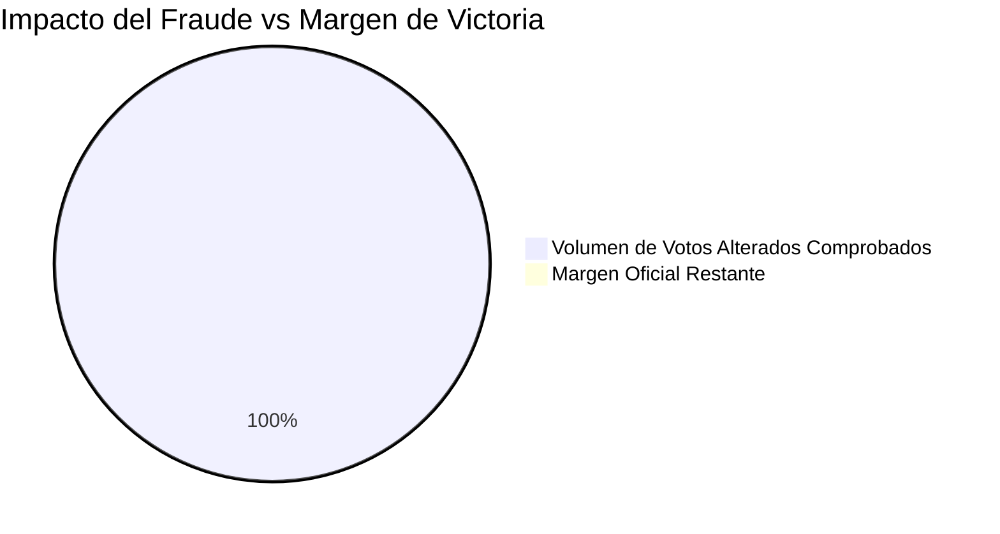

# 🏛️ GUÍA DIDÁCTICA PARA JUECES Y MAGISTRADOS
**Comprendiendo el Fraude Técnico en los Formularios E-14 (9 Pilares Probatorios)**

> [!IMPORTANT]
> Esta guía está diseñada para explicar los conceptos técnicos y criptográficos descubiertos durante la auditoría forense masiva de 121.960 actas, traduciéndolos al lenguaje jurídico. El acervo probatorio demuestra inequívocamente la **violación sistemática de la cadena de custodia** y la **falsedad ideológica en documento público** a través de medios informáticos.

---

## Cuadro Probatorio de Ciberdelitos y Falsedad Material

A continuación, se tabulan los 9 pilares de la evidencia recabada, cruzando el hallazgo técnico con su correspondiente tipificación jurídica.

| Pilar Probatorio | Descripción Técnica Forense | Tipificación Jurídica e Implicación Legal |
| :--- | :--- | :--- |
| **1. Censo Base** | Expansión artificial del Censo Electoral en mesas clave. (Ej. reportar 454.000 donde solo hay 160.000). | **Falsedad Material Demográfica:** Creación de "espacio matemático" ilícito para permitir inyección de votos. |
| **2. Códigos QR** | Inyección de una segunda capa de Código QR falso sobre el verdadero. (Ver [EVIDENCIA_QR](../01_EVIDENCIA/EVIDENCIA_QR_DOBLES_FALSIFICADOS.md)) | **Suplantación y Desvío Criptográfico (Spoofing):** Prueba reina de dolo para desviar informáticamente los resultados hacia un ID de mesa distinto. |
| **3. Foliación** | Mezcla de páginas a color originales con fotocopias B/N en el mismo pliego litográfico. | **Alteración Material del Instrumento Público:** Prueba de manipulación humana y sustitución física antes del escaneo. |
| **4. XREF (PDF)** | Tabla de referencias cruzadas dañada (15 objetos declarados, 13 existentes). | **Falsedad Ideológica Informática:** Evidencia de paso por software de reempaquetado masivo, no es un escaneo óptico fiel. |
| **5. Blind Masking** | Inyección de capas vectoriales (`DeviceGray`) sobre el fondo ruidoso. | **Enmascaramiento Óptico:** Adulteración de la superficie visible del documento mediante comandos vectoriales. |
| **6. Sin EXIF** | Carencia absoluta de metadatos de hardware de escaneo (Deepfake documental). | **Violación de Cadena de Custodia:** Imagen generada por software, carente de valor probatorio primario. |
| **7. Vote Swapping** | Intercambio de valores entre candidatos ($V_1 \leftrightarrow V_2$) manteniendo constante el total de la mesa. | **Sustitución Automatizada:** Dolo informático diseñado para engañar el cuadre manual de los escrutadores. |
| **8. Determinancia** | El volumen de fraude mapeado representa el 175.1% del margen oficial de victoria. | **Causal Directa de Nulidad Electoral:** El fraude es superior y determinante sobre el resultado final. |
| **9. Ley del segundo dígito de Mebane** | Imposibilidad matemática estocástica; ausencia de varianza humana natural (Espejo Absoluto). | **Planchado Estadístico:** Prueba matemática de que los números fueron inyectados por un bucle algorítmico. |

---

## Gráfico Forense: Determinancia de la Nulidad

> [!WARNING]
> En el derecho electoral, el fraude debe ser **"determinante"** para anular una elección. El siguiente gráfico ilustra cómo el volumen de la alteración estructural devoró el estrecho margen oficial.

---

> [!CAUTION]
> ### Conclusión para el Tribunal
> Los formularios E-14 presentados por la autoridad electoral como evidencia oficial **carecen de toda validez probatoria**. 
> No son digitalizaciones fidedignas de la voluntad popular, sino **reconstrucciones digitales sintéticas** creadas *a posteriori* a través de una fábrica de falsificación automatizada que dejó cicatrices irrefutables a nivel físico, informático y estadístico.
