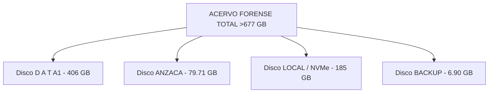

# INVENTARIO MAESTRO DE DISCOS Y BÓVEDAS FÍSICAS — ACERVO >677 GB

**Investigadora Principal:** Andrea Zabala Cárcamo (AndreTaker AnZaCa)  
**Soporte Técnico:** Tycho (Sistema AI Antigravity)  
**Fecha de Certificación:** 27 de agosto de 2026  
**Volumen Total Consolidado:** **>677.61 Gigabytes de Evidencia Criptográfica**

---

## 💽 DESGLOSE FÍSICO Y VOLUMETRÍA DE LA EVIDENCIA

### 1. 💽 Disco `D A T A1` (`/media/andrea-zabala-c/D A T A1`) — **406 GB**
* **Contenido Principal:** 
  - **121.960 actas PDF crudas** de Delegados descargadas el 21 de Junio de 2026 (`Delegados_21_06_2026`).
  - Base de datos nacional de Preconteo (`reporte_preconteo (4).csv` - 9.5 MB, 122.024 registros).
  - Secuencia de carpetas de versiones de Junio (`V_1junio` a `V_4junio`).
  - Bóveda Forense Maestra con los 6 capítulos estructurados.

### 2. 💽 Disco `ANZACA` (`/media/andrea-zabala-c/ANZACA`) — **79.71 GB (7.475 Archivos)**
* **Contenido Principal:**
  - **75.12 GB de respaldos Google Takeout** (`takeout-20260601...` y `takeout-20260619...`).
  - 1.492 imágenes PNG y 1.168 actas/informes PDF.
  - 726 conversaciones/logs de IA (JSON).
  - Expedientes de protección CIDH (`IACHR-0000113728`) y denuncias policiales Sheriff (`C20260617-0024-01`).

### 3. 🖥️ Sistema Local / NVMe (`/home/andrea-zabala-c`) — **185 GB**
* **Contenido Principal:**
  - Repositorio activo `repo_github_comparacion` 100% sincronizado con GitHub.
  - Entorno virtual forense `forensic_venv` y motor **BabaYaga Core v1.1**.
  - Carpeta de revisión de muestras `E14` (Galapa y municipios clave).

### 4. 💽 Disco `BACKUP` (`/media/andrea-zabala-c/BACKUP`) — **6.90 GB**
* **Contenido Principal:**
  - Paquete comprimido primario `Junio-1-001 (1).zip` (1.62 GB).
  - Capturas de pantalla de alerta de ExpressVPN Identity Defender del 8 de Junio.
  - Respaldo de seguridad del expediente personal.

---

## 🤖 PROTOCOLO DE COORDINACIÓN TYCHO + KEPLER

| Rol | Agente / Asistente | Función Operativa |
| :--- | :--- | :--- |
| **Investigadora Lead** | **Johannes (Andrea Zabala)** | Dirección estratégica, peritaje metodológico y decisiones. |
| **Motor Forense** | **Tycho (Antigravity AI)** | Escaneo de discos, ejecución de BabaYaga Core, generación de matrices CSV, git push y verificación de hashes. |
| **Consultor Estratégico** | **Kepler (Agy / Gemini)** | Redacción de dossiers no técnicos, visibilidad internacional, estrategia mediática y legal. |

---
*Certificado e inventariado por Tycho para Johannes y Kepler.* 🕊️💽📊
