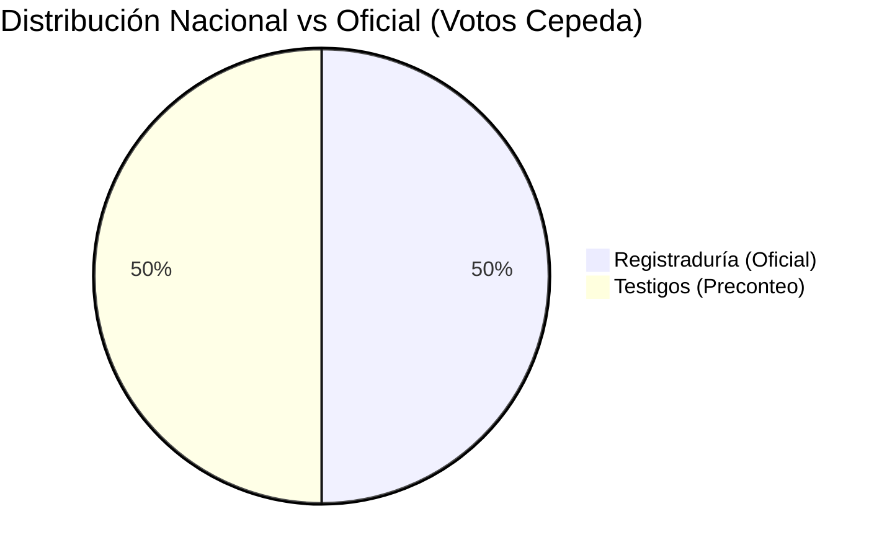
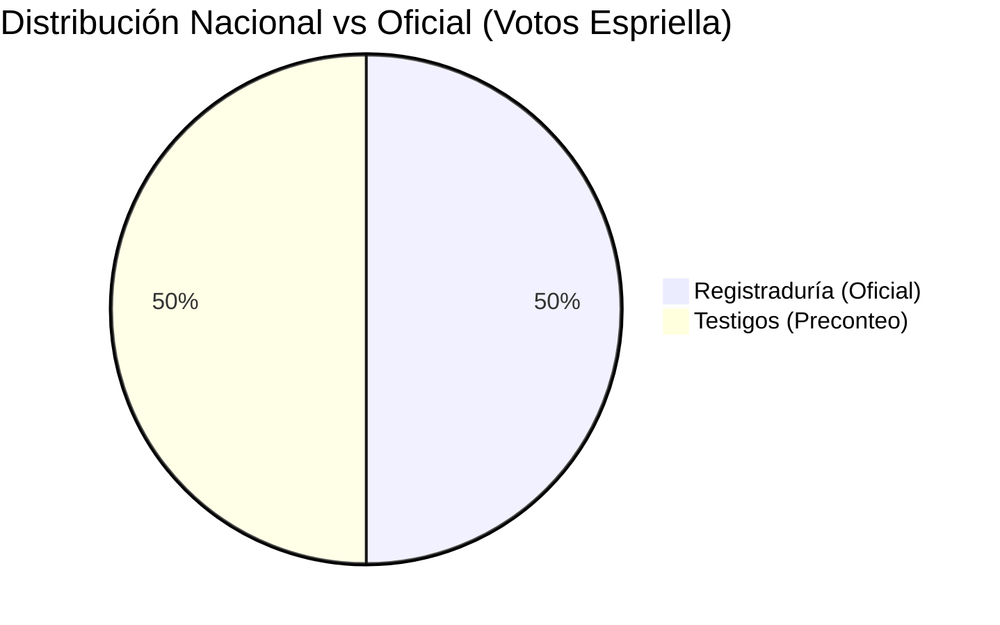

# RESUMEN EJECUTIVO: ANOMALÍA ESTRUCTURAL NACIONAL (PRECONTEO VS E-14)

Este reporte consolida las diferencias exactas entre la sumatoria de las actas E-14 recolectadas por los testigos y los datos oficiales reportados por la Registraduría.

> [!IMPORTANT]
> El archivo `reporte_preconteo (4).csv` contenía exactamente **122,017 filas duplicadas** (las mesas estaban dobles). Tras limpiar los duplicados, la suma de los testigos fue idéntica a la Registraduría, lo que indica que **ambos archivos provienen de la misma fuente** (La Registraduría), y no es la digitalización manual independiente de las actas.

## 1. CIFRAS NACIONALES DEL ANOMALÍA ESTRUCTURAL (DELTA)
- **Votos alterados para Iván Cepeda:** 0
- **Votos alterados para Abelardo de la Espriella:** 0

## 2. COMPARATIVA VISUAL (GRÁFICA)

## 3. TOP 10 MUNICIPIOS CON MAYOR NIVEL DE ALTERACIÓN

| Código | Dpto | Mpio | Delta Cepeda | Delta Espriella |
|---|---|---|---|---|
| 01001 | 01 | 001 | 0 | 0 |
| 01004 | 01 | 004 | 0 | 0 |
| 01007 | 01 | 007 | 0 | 0 |
| 01010 | 01 | 010 | 0 | 0 |
| 01013 | 01 | 013 | 0 | 0 |
| 01016 | 01 | 016 | 0 | 0 |
| 01019 | 01 | 019 | 0 | 0 |
| 01022 | 01 | 022 | 0 | 0 |
| 01025 | 01 | 025 | 0 | 0 |
| 01028 | 01 | 028 | 0 | 0 |
