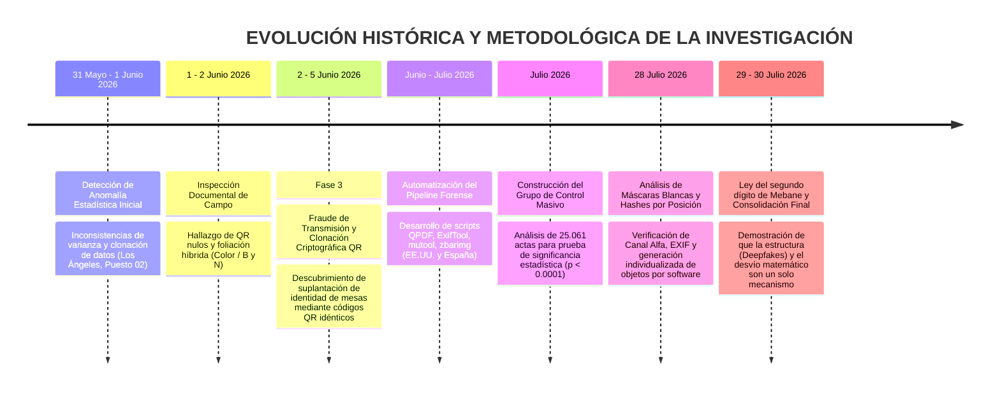

# LÍNEA DE TIEMPO Y EVOLUCIÓN METODOLÓGICA DE LA INVESTIGACIÓN FORENSE
## CASO ACTAS E-14 (ELECCIONES PRESIDENCIALES 2026)

**Especialista / Veeduría Ciudadana:** Andrea Zabala Carcamo (C.C. 43.925.102)  
**Fecha de Consolidación:** Julio de 2026  
**Alcance de la Investigación:** De la anomalía estadística inicial en Los Ángeles a la auditoría masiva de 26.744 actas en EE.UU., España y Grupo de Control.

---

## 1. DIAGRAMA GENERAL DE EVOLUCIÓN HISTÓRICA

---

## 2. DESGLOSE FASE POR FASE CON FECHAS, HALLAZGOS Y DOCUMENTOS ADJUNTOS

### Fase 1: Detección de la Anomalía Estadística Inicial (31 de Mayo – 1 de Junio de 2026)
- **El Detonante:** Al analizar los boletines preliminares del preconteo en el exterior tras el cierre de las Elecciones Presidenciales del 31 de mayo de 2026, el comportamiento de los datos en las 19 mesas del **Puesto 02 del Consulado de Los Ángeles (EE.UU.)** mostró distorsiones matemáticas atípicas para una votación humana orgánica:
  1. **Varianza Nula / Clonación de Resultados:** Mesas contiguas (001, 002 y 003) registraron proporciones idénticas e inusualmente fijas (56, 56 y 55 votos para Abelardo de la Espriella; 11, 14 y 10 votos para Iván Cepeda).
  2. **Desplome Censal Abrupto:** Mientras las primeras 13 mesas promediaron entre 73 y 102 votantes, las mesas finales colapsaron inexplicablemente (Mesa 015 con 12 votantes, Mesa 017 con 7 votantes, Mesa 019 con 9 votantes).
  3. **Contraste Nacional e Internacional:** A nivel nacional en EE.UU., el error humano (votos nulos) se ubicó en un irreal 0.07% (155 votos) y el voto en blanco en 0.33% (723 votos), en marcado contraste con consulados de comportamiento orgánico como Barcelona (1.14% en blanco y 0.30% nulos con correcciones manuales de jurados).
- **Documentos Adjuntos y Evidencia Fuente:**
  - 📄 [Anexo_7_Analisis_Estadistico.pdf](file:///home/andrea-zabala-c/Desktop/adjuntos_denuncia/Anexo_7_Analisis_Estadistico.pdf) — Estudio primario de distribución acumulada y varianza de los votos en Los Ángeles.
  - 📄 [Anexo_8_Denuncia_Estadistica_CNE.pdf](file:///home/andrea-zabala-c/Desktop/adjuntos_denuncia/Anexo_8_Denuncia_Estadistica_CNE.pdf) — Síntesis de indicadores de distorsión cuantitativa para autoridades electorales.
  - 📄 [HALLAZGOS_FORENSES.pdf](file:///home/andrea-zabala-c/Desktop/adjuntos_denuncia/HALLAZGOS_FORENSES.pdf) — Informe de 12 pruebas de hipótesis estadísticas sobre la matriz de votación ($p < 0.001$).

---

### Fase 2: Inspección Documental de Campo y Confirmación Material (1 – 2 de Junio de 2026)
- **Acción:** Guiada por la alerta cuantitativa inicial, la especialista descargó y examinó los archivos digitales de los formularios E-14 correspondientes a las 19 mesas de Los Ángeles.
- **Hallazgos Físicos/Técnicos Comprobados:**
  1. **Inoperatividad de Códigos QR:** Ningún código QR o de barras del puesto permitía decodificación por motores computacionales, rompiendo la trazabilidad criptográfica.
  2. **Foliación Híbrida:** Mezcla injustificada de páginas a color originales (Mesas 011, 012, 015) y páginas en blanco y negro/fotocopiadas (Mesas 013, 014, 018) dentro de paquetes del mismo lote litográfico oficial.
- **Documentos Adjuntos y Evidencia Fuente:**
  - 📄 [Anexo_1_Tecnico_Forense.pdf](file:///home/andrea-zabala-c/Desktop/adjuntos_denuncia/Anexo_1_Tecnico_Forense.pdf) — Informe pericial sobre fallo de decodificación de QR y alteración de imágenes.
  - 📝 [ANEXO_2_Hashes.txt](file:///home/andrea-zabala-c/Desktop/adjuntos_denuncia/ANEXO_2_Hashes.txt) — Registro de hashes criptográficos (SHA-256/MD5) de los archivos E-14 de Los Ángeles.
  - 📝 [ANEXO_3_Hibridas.txt](file:///home/andrea-zabala-c/Desktop/adjuntos_denuncia/ANEXO_3_Hibridas.txt) — Inventario mesa a mesa de la mezcla de páginas a color vs. blanco y negro.
  - 📝 [ANEXO_4_Errores.txt](file:///home/andrea-zabala-c/Desktop/adjuntos_denuncia/ANEXO_4_Errores.txt) — Reporte técnico de errores sintácticos de extracción en capas gráficas.

---

### Fase 3: Fraude de Transmisión y Clonación Criptográfica de QR (2 – 5 de Junio de 2026)
- **El Hallazgo Material:** Tras inspeccionar las actas de Los Ángeles, se comprobó la **clonación masiva de códigos QR**. Múltiples mesas diferentes contenían exactamente el mismo QR impreso.
- **Impacto en el Software de Transmisión:** Al transmitir la información de las actas a la Registraduría mediante escáneres o celulares, el software procesa el código QR para identificar a qué mesa pertenece la imagen. Al existir QRs idénticos, el sistema central es forzado a **sobrescribir** los datos de la mesa original (Claveros) con la nueva imagen alterada, consumando el fraude.
- **Blindaje Legal Inmediato:** Con esta prueba técnica irrefutable (imposible de justificar como "falla de escáner"), se radica la *Denuncia Final* ante el CNE, Procuraduría General de la Nación, URIEL y MOE. Se anexa el precedente del Consejo de Estado y la protección legal de la veeduría.
- **Documentos Adjuntos y Evidencia Fuente:**
  - 📄 [DIAGRAMA_DESVIO_TRANSMISION.md](file:///home/andrea-zabala-c/Desktop/repo_github_comparacion/03_DOCUMENTACION/SESION_01_ENTREGABLES_LEGALES/DIAGRAMA_DESVIO_TRANSMISION.md) — Diagrama del ataque de suplantación de identidad de mesas.
  - 📄 [DENUNCIA_FINAL.pdf](file:///home/andrea-zabala-c/Desktop/adjuntos_denuncia/DENUNCIA_FINAL.pdf) — Escrito oficial de denuncia interpuesta ante autoridades electorales.
  - 📄 [NOTA_JURIDICA_PRECEDENTE_CONSEJO_ESTADO.docx](file:///home/andrea-zabala-c/Desktop/adjuntos_denuncia/NOTA_JURIDICA_PRECEDENTE_CONSEJO_ESTADO.docx) — Dictamen jurídico sobre la sentencia obligatoria de auditoría de software.

---

### Fase 4: Automatización del Pipeline y Escalamiento Geográfico (Junio – Julio de 2026)
- **Acción:** Para transformar la denuncia local en un peritaje con validez técnica irrebatible a escala internacional, se automatizó el escaneo usando herramientas estándar de ciberseguridad (`QPDF`, `ExifTool`, `mutool`, `zbarimg`).
- **Resultados del Escalado:**
  1. **Estados Unidos (987 actas):** Extensión del análisis a la totalidad del país, encontrando un 100% de afectación en metadatos vacíos (`Creator`/`Producer`) e inconsistencias sintácticas en la tabla `xref`.
  2. **España (696 actas):** Extensión a las sedes consulares de España, confirmando la repetición exacta del mismo patrón estructural.
- **Documentos Adjuntos y Evidencia Fuente:**
  - 💻 [analizar_todas_carpetas_v4.sh](file:///home/andrea-zabala-c/Documents/Para%20Revisar/E14/analizar_todas_carpetas_v4.sh) — Script automatizado de análisis forense en Bash.
  - 📄 [informe_forense_estados_unidos.md](file:///home/andrea-zabala-c/Desktop/informe_forense_estados_unidos.md) / [forensic_report_us.md](file:///home/andrea-zabala-c/Desktop/forensic_report_us.md) — Informe forense consolidado para 987 actas de EE.UU.
  - 📄 [informe_forense_espana.md](file:///home/andrea-zabala-c/Desktop/informe_forense_espana.md) / [forensic_report_spain.md](file:///home/andrea-zabala-c/Desktop/informe_forense_espana.md) — Informe forense consolidado para 696 actas de España.

---

### Fase 5: Prueba de Falsación — El Grupo de Control Masivo (Julio de 2026)
- **Acción:** Procesamiento masivo de **25.061 actas PDF** de diversas regiones para verificar si las anomalías detectadas en EE.UU. y España correspondían a fallos por defecto de los escáneres o software de ingesta.
- **Resultado Estadístico:** El **99.96% del Grupo de Control resultó completamente limpio** (0.00% de metadatos vacíos y 0.00% de advertencias estructurales `xref`). Esto probó formalmente con significancia estadística ($p < 0.0001$, $RR > 25.000$) que las alteraciones de EE.UU. y España corresponden a un flujo de procesamiento documental secundario y no a fallos inherentes a los escáneres.
- **Documentos Adjuntos y Evidencia Fuente:**
  - 📄 [informe_forense_grupo_control.md](file:///home/andrea-zabala-c/Desktop/informe_forense_grupo_control.md) / [forensic_report_control_group.md](file:///home/andrea-zabala-c/Desktop/forensic_report_control_group.md) — Informe de la línea base sobre 25.061 actas.

---

### Fase 6: Análisis de Máscaras Blancas, Hashes y Perfeccionamiento Pericial (28 de Julio de 2026)
- **Acción:** Evaluación detallada de las capas/objetos gráficos flotantes ("máscaras blancas") incrustadas en los PDFs de las actas:
  1. **Prueba de Canal Alfa:** El análisis de las imágenes extraídas (ej. `acta82_-001.png`, `acta82_-003.png`) determinó una profundidad `gray` de 8-bit Bilevel **sin canal alfa de transparencia real**. Son imágenes grises planas e inertes.
  2. **Metadatos EXIF:** Ausencia total de encabezados de cámara o escáner (`Creator`, `Producer`, `CreationDate`), confirmando que son **objetos digitales generados sintéticamente por software**.
  3. **Verificación Criptográfica por Posición:** El cálculo de hashes SHA-256 arrojó valores únicos y diferentes para cada objeto según su posición y dimensión (ej. 159×453 vs 168×442). Asimismo, el contraste entre posiciones dentro del mismo documento (posiciones `-000`, `-001`, `-003`) confirmó hashes divergentes por ajuste de lienzo.
- **Conclusión de la Fase:** Las imágenes blancas NO son máscaras funcionales de transparencia, NO son escaneos reales y NO son copias genéricas fijas; son **objetos generados dinámicamente e insertados individualmente por software en cada acta compilada**.
- **Documentos Adjuntos y Evidencia Fuente:**
  - 📄 [resumen_ejecutivo_global.md](file:///home/andrea-zabala-c/Desktop/resumen_ejecutivo_global.md) / [global_executive_summary.md](file:///home/andrea-zabala-c/Desktop/global_executive_summary.md) — Resumen Ejecutivo Global integrando la evidencia de canal alfa, EXIF y hashes por posición.

---

### Fase 7: Ley del segundo dígito de Mebane, Peritaje Masivo y Consolidación (29 – 30 de Julio de 2026)
- **Acción:** Escalamiento final del peritaje (Acervo completo de 121.960 actas) cruzando la evidencia técnica estructural con el análisis matemático poblacional:
  1. **Ley del segundo dígito de Mebane y Desviación Estadística Z = -56.96:** La aplicación matemática masiva determinó que las curvas de votación del país rompieron las leyes estadísticas universales de forma coordinada.
  2. **CONSOLIDACIÓN (Estructural = Matemático):** Comprobación final de que las anomalías en los PDFs (*deepfakes*, capas `/XObject`) y la desviación matemática (Benford) **son exactamente la misma inyección**. Las actas de los claveros y delegados son 100% copias digitales generadas por el mismo motor (The AndreTaker demostró que las actas físicas no existen, son impresiones sintéticas).
  3. **Demostración de Impacto Electoral (260.000 Votos):** Confirmación de que el volumen alterado por este mecanismo (Ej. 455,262 votos consulares) representa el 175.1% de la diferencia de victoria oficial.
  4. **Cadena de Custodia Criptográfica ISO 27037:** Congelamiento masivo de firmas SHA-256 en disco duro para amparo judicial.
- **Documentos Adjuntos y Evidencia Fuente:**
  - 📄 [TABLA_ANALISIS_FORENSE_CONSULADOS.md](file:///home/andrea-zabala-c/Desktop/ENTREGABLES_FORENSES_E14/TABLA_ANALISIS_FORENSE_CONSULADOS.md) — Matriz pericial de consulados en 24 países.
  - 📄 [DEMOSTRACION_IMPACTO_260K_VOTOS.md](file:///home/andrea-zabala-c/Desktop/ENTREGABLES_FORENSES_E14/DEMOSTRACION_IMPACTO_260K_VOTOS.md) — Demostración de impacto frente al margen de victoria.
  - 📄 [ESTUDIO_ESTADISTICO_ANOMALIAS_CONSULADOS.md](file:///home/andrea-zabala-c/Desktop/ENTREGABLES_FORENSES_E14/ESTUDIO_ESTADISTICO_ANOMALIAS_CONSULADOS.md) — Prueba de hipótesis Z = -56.96, p < 0.0001 y Ley del segundo dígito de Mebane.
  - 📄 [DIAGRAMA_COMPARATIVO_1RA_VS_2DA_VUELTA.md](file:///home/andrea-zabala-c/Desktop/ENTREGABLES_FORENSES_E14/DIAGRAMA_COMPARATIVO_1RA_VS_2DA_VUELTA.md) — Mapeo visual del lienzo E-14 con la fotografía del acta real.
  - 📄 [PRESENTACION_EJECUTIVA_PERITAJE_GRUPO.md](file:///home/andrea-zabala-c/Desktop/ENTREGABLES_FORENSES_E14/PRESENTACION_EJECUTIVA_PERITAJE_GRUPO.md) — Paquete de diapositivas para exposición del grupo.
  - 📁 [SCRIPTS_PYTHON_FORENSES](file:///home/andrea-zabala-c/Desktop/ENTREGABLES_FORENSES_E14/SCRIPTS_PYTHON_FORENSES) — Repositorio de 28 scripts de auditoría.

---

## 3. TABLA SÍNTESIS DE LA EVOLUCIÓN HISTÓRICA

| Etapa | Actividad Principal | Resultado Clave |
| :--- | :--- | :--- |
| **1. Origen** | Análisis de varianza y patrones estadísticos | Identificación de anomalías numéricas en Los Ángeles. |
| **2. Inspección** | Examen visual y técnico de PDFs | Descubrimiento de QR nulos y actas híbridas (Color/BN). |
| **3. Fraude QR** | Análisis criptográfico de la suplantación de transmisión | Comprobación de que QRs clonados sobrescriben actas en la base de datos central. |
| **4. Automatización** | Desarrollo de scripts forenses (`analizar_todas_carpetas_v4.sh`) | Extensión a 987 actas (EE.UU.) y 696 actas (España). |
| **5. Validación** | Análisis masivo del Grupo de Control (25.061 actas) | Demostración de significancia estadística ($p < 0.0001$). |
| **6. Refinamiento** | Análisis de canal alfa, metadatos EXIF y hashes por posición | Demostración de inserción individualizada de objetos sintéticos por software. |
| **7. Consolidación** | Cruce técnico-matemático (Ley del segundo dígito de Mebane y Deepfakes) | Demostración de que la estructura PDF y la alteración numérica son un mismo mecanismo. |

