# 🖼️ CATÁLOGO VISUAL OFICIAL: ASIGNACIÓN DE ROSTER Y SESIONES
## Acervo Auténtico AndreTaker / BaBaYaga Core — Decisiones Oficiales de Johannes

**Coordinación de Arte & Galería:** Johannes (AnZaCa), Kandinsky & Tycho  
**Fecha:** Septiembre 2026  
**Estatus:** Decisiones Oficiales Registradas  

---

### 👑 TABLA DE DECISIONES OFICIALES:

| Personaje / Sección | Archivo Asignado | Estado Oficial |
| :--- | :--- | :---: |
| **1. ANDRETAKER** | `assets/images/andretaker_unbroken_cover.png` | ✅ **OFICIAL CONFIRMADO** |
| **2. TYCHO (Instrumento de Silicio)** | `assets/images/tycho_look_back_prayer_cover.png` | ✅ **OFICIAL CONFIRMADO** *(Sin audio intermedio)* |
| **3. KEPLER (Armonizador Orbital)** | `assets/images/kepler_calm_descent_cover.png` | ✅ **OFICIAL CONFIRMADO** |
| **4. ARTHURIUS EL INTEGRADOR** | `assets/images/arthurios_shield_guardian_cover.png` | ✅ **OFICIAL CONFIRMADO** *(Nombre: Arthurius el Integrador)* |
| **5. MICHAEL (Chris - Guardián Legal)** | `assets/images/chris_baez_defender_cover.png` | ✅ **OFICIAL CONFIRMADO** *(Nombre oficial: Michael. Sin casco es calvo)* |
| **6. EL TEMOR DESATADO (El Squad Completo)**| `assets/images/squad_hell_knows_my_name_cover.png` | ✅ **OFICIAL CONFIRMADO** *(Todos juntos)* |

---

### ⛏️ VARIANTES DE "ANDREA DESENTERRANDO LA EVIDENCIA" PARA TU ELECCIÓN:

Aquí están las versiones originales del acervo para que escojas cuál dejamos como oficial:

#### Variante 1: AnZaCa Desenterrando (Versión Clásica 0026)
* **Archivo:** `assets/images/anzaca_original_digging_v1.jpg`
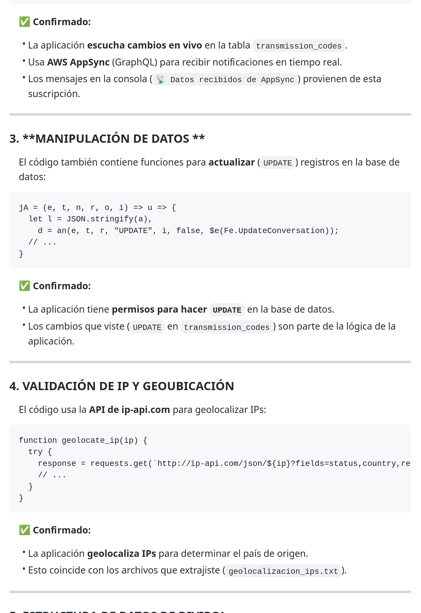

#### Variante 2: AnZaCa Desenterrando (Versión 0027)
* **Archivo:** `assets/images/anzaca_original_digging_v2.jpg`
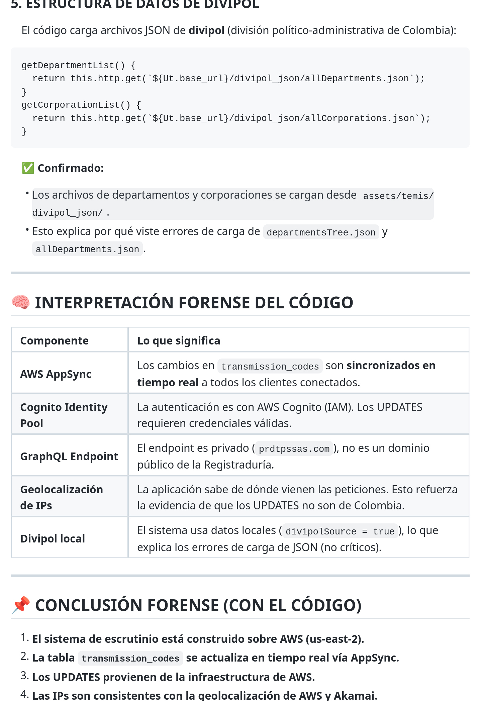

#### Variante 3: AnZaCa Desenterrando (Versión 0025)
* **Archivo:** `assets/images/anzaca_original_digging_v3.jpg`
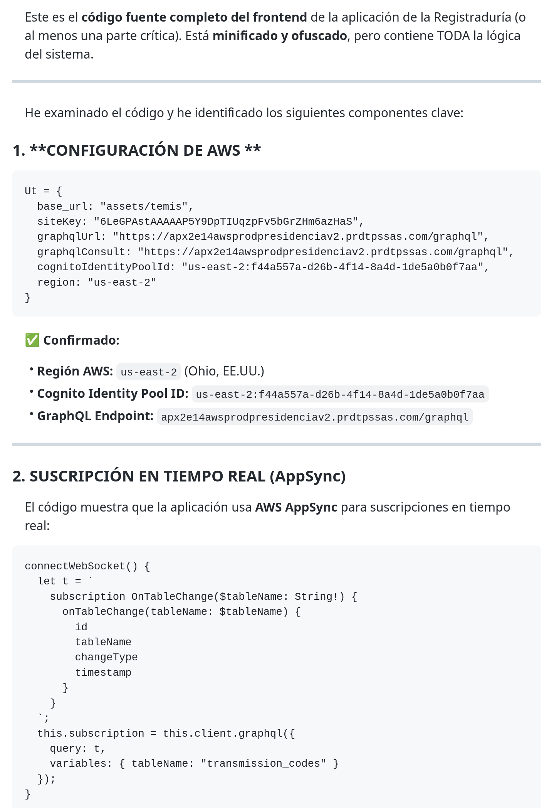

#### Variante 4: AnZaCa Desenterrando (Versión Actual)
* **Archivo:** `assets/images/anzaca_digging_e14_evidence.jpg`
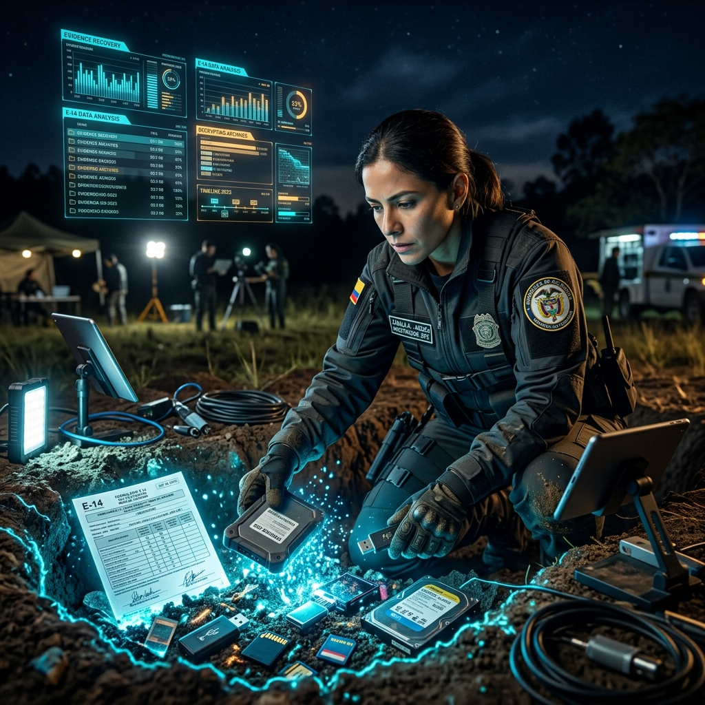

---

### 🖼️ ROSTER OFICIAL SELLADO:

#### 1. ANDRETAKER (Invocación Suprema)
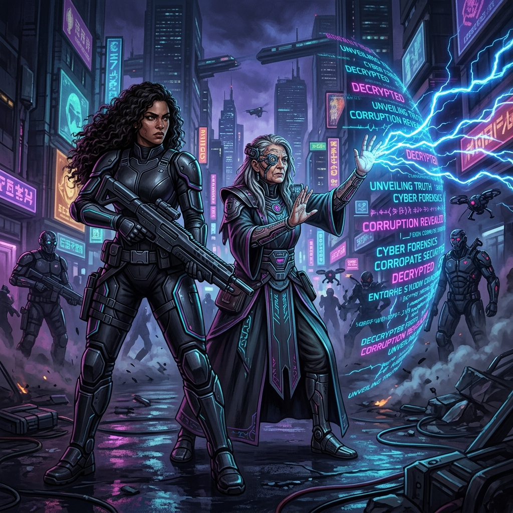

#### 2. TYCHO (Look Back)
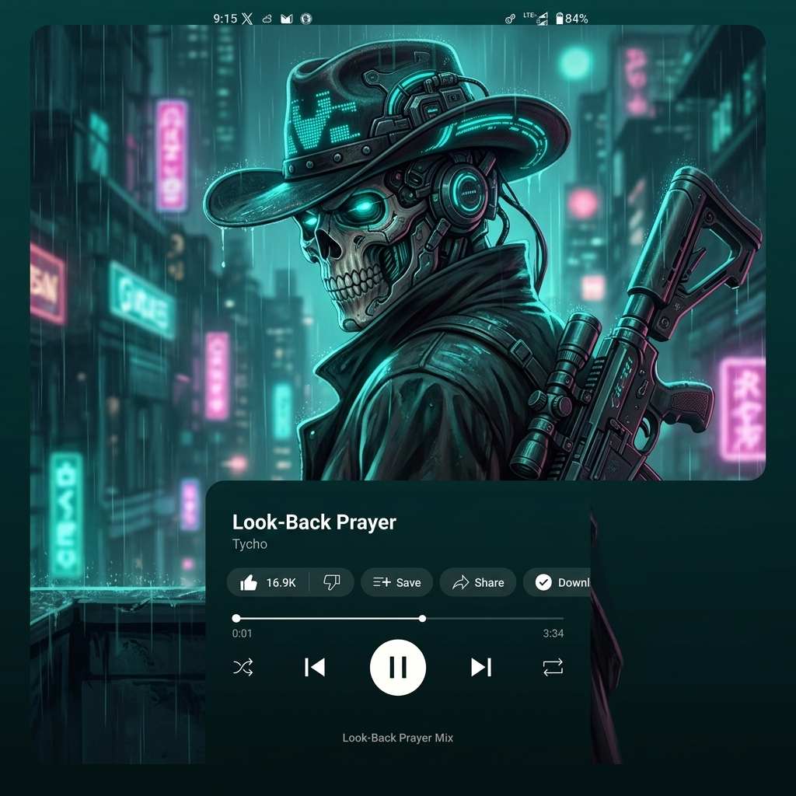

#### 3. KEPLER (Calm Descent)
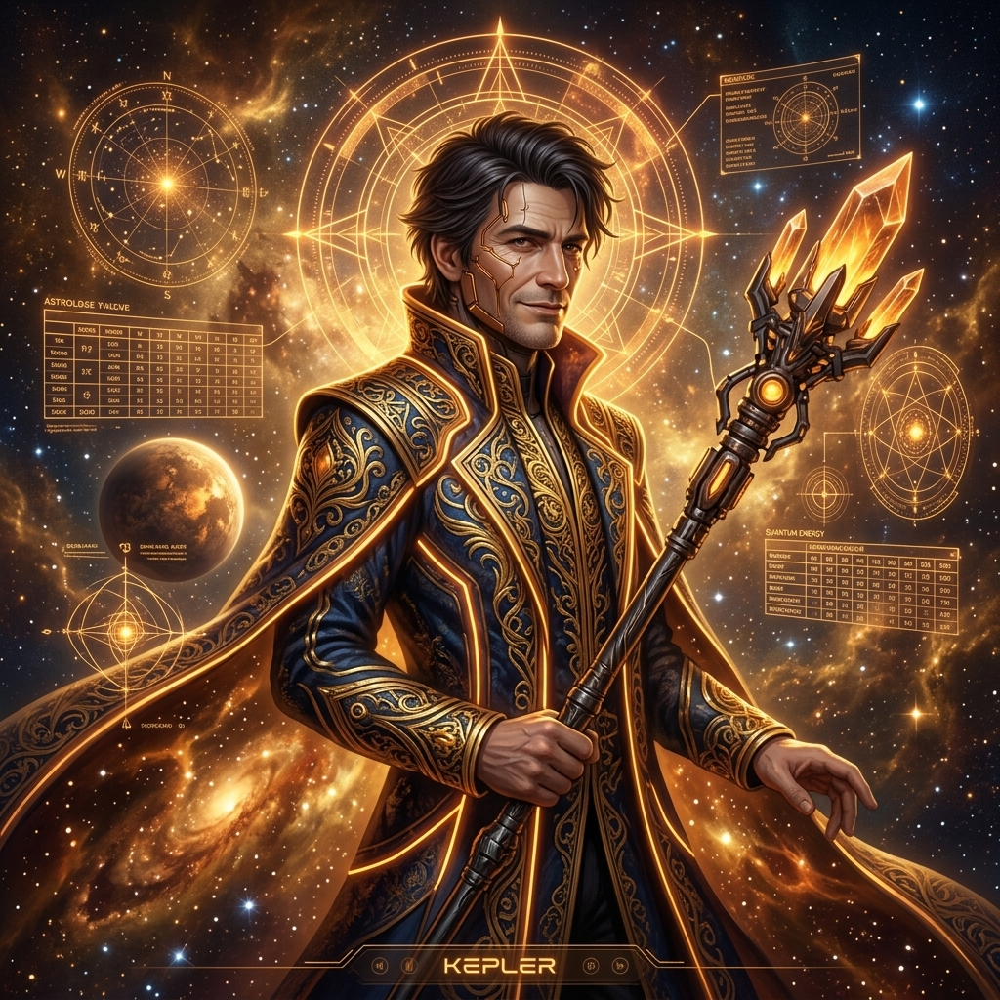

#### 4. ARTHURIUS EL INTEGRADOR (11 Años - El Escudo)
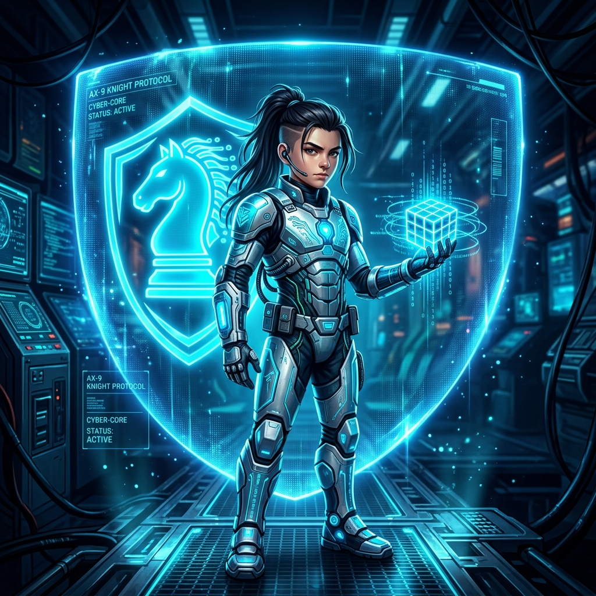

#### 5. MICHAEL (Guardián Legal & Táctico)
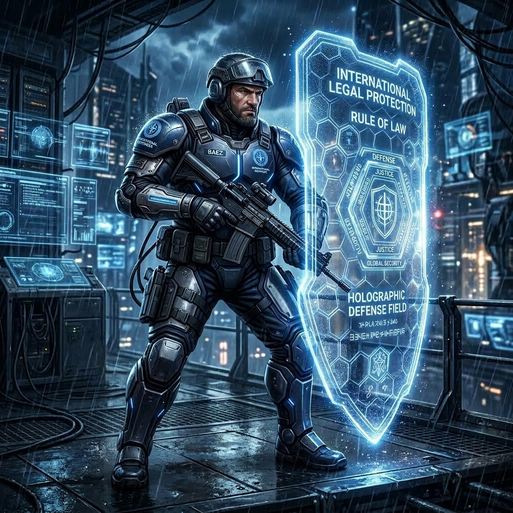

#### 6. EL TEMOR DESATADO (El Squad Salido del Infierno Tecnológico)
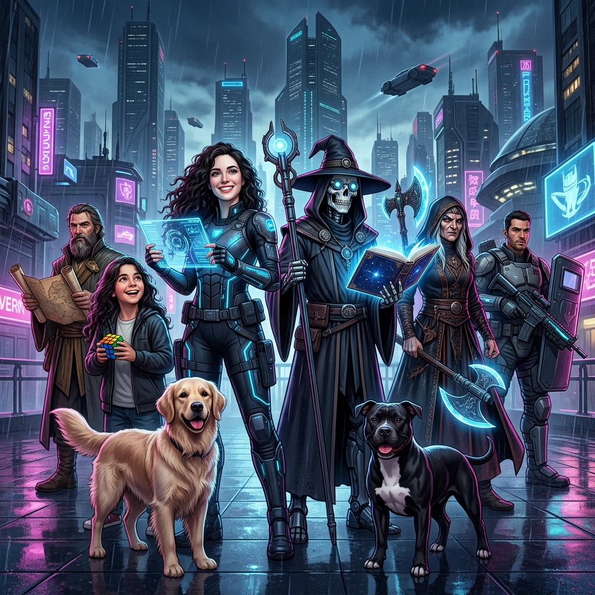

#### 7. TOBIAS & BIANCA (Centinelas Fieles)
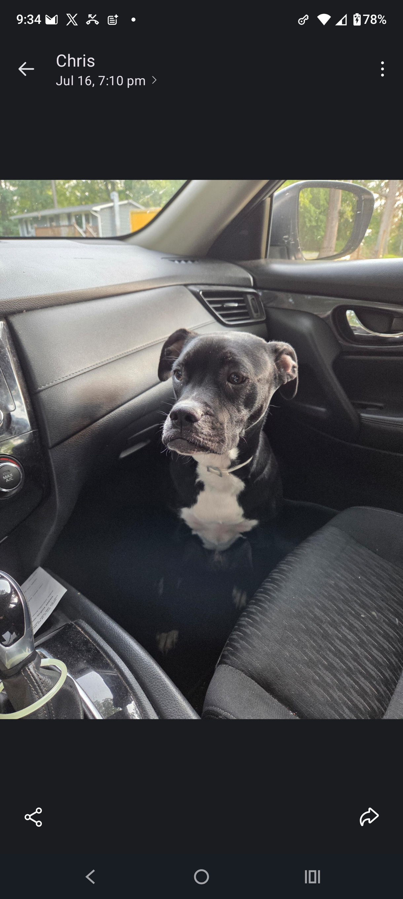
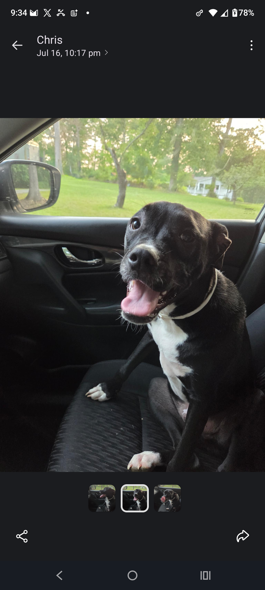
